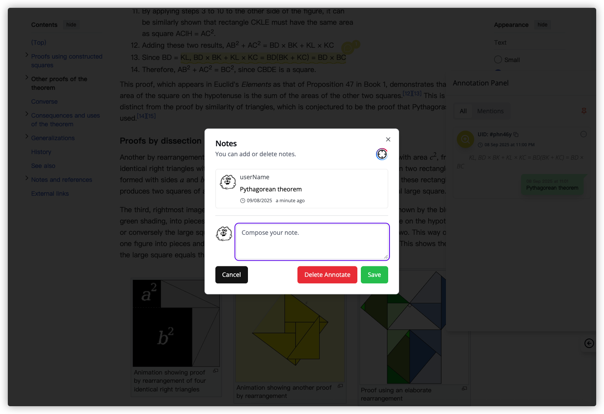
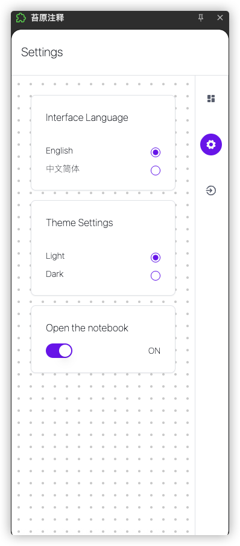

# <p align="center">Tundra Annotation - Browser Extension</p>

<p align="center">
  <em>An open source web note taking / highlighter browser plugin.</em>
</p>
<p align="center">
    
    
    
    
    
</p>

## 🚀 Features

- Accurate serialization and deserialization can adapt to most web pages
- This plugin supports highlighting the formula part
- Powerful and reliable web highlighting
- This plugin supports multiple highlight styles and can be customized
- Modern technology stack
- This plugin supports dark mode and localization
- Reserve note comment function
- Backend services coming soon

## ❇️ Tech Stack

- ✅ **Wxt**: [Wxt](https://wxt.dev)
- ✅ **React**: [React](https://react.dev/)
- ✅ **Tailwind css**: [Tailwind css](https://tailwindcss.com)
- ✅ **Shadcn UI**: [Shadcn UI](https://ui.shadcn.com)
- ✅ **Zustand**: [Zustand](https://zustand-demo.pmnd.rs)
<p align="center">
  
  
  
</p>

## 📦 Running chrome extension

First, you need to install WXT globally

```
pnpm i -D wxt
```

Second, you need to install project
dependencies, then run the project

```
pnpm install
pnpm run dev
```

When you have completed these steps, `WXT` will help you open new tabs

<p align="center">
  
</p>

## 💼 Packages

```
.
├── assets
│   ├── avatar.jpg
│   ├── empty.webp
│   ├── font.css
│   ├── main.css
│   ├── react.svg
│   └── underConstruction.webp
├── components
│   ├── chatBubble
│   ├── collapsePanel
│   ├── dotMatrix
│   ├── edgeSnapDraggable
│   ├── i18Config.ts
│   ├── i18n.ts
│   ├── icons
│   ├── settings
│   ├── skeletonLoader
│   └── ui
├── components.json
├── entrypoints
│   ├── background.ts
│   ├── content
│   ├── popup
│   ├── sidebar.tsx
│   ├── sidepanel
│   └── type.ts
├── hooks
│   ├── useMobile.tsx
│   ├── useStorage.tsx
│   └── useStorage.type.ts
├── lib
│   ├── Marks
│   ├── SelectionObserver.ts
│   ├── Utils.ts
│   └── ZodValidator.ts
├── locales
│   ├── en
│   └── zh_CN
├── md
│   ├── image-2.png
│   ├── image-3.png
│   ├── image-4.png
│   └── image.png
├── package.json
├── pnpm-lock.yaml
├── postcss.config.js
├── public
│   ├── _locales
│   ├── icon
│   └── wxt.svg
├── README.md
├── services
│   ├── api.ts
│   ├── api.type.ts
│   └── services.ts
├── state
│   ├── constant.ts
│   ├── hooks.ts
│   ├── index.tsx
│   ├── store.ts
│   └── type.ts
├── tailwind.config.js
├── tsconfig.json
└── wxt.config.ts
```

## 📦 Building chrome extension

```
pnpm run build
```

## 👀 Considerations

The `services.ts` file contains mock data, which can be modified by yourself

```
├── services
│   ├── api.ts
│   ├── api.type.ts
│   └── services.ts
```
