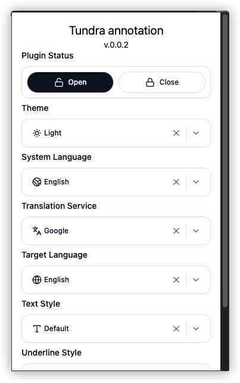
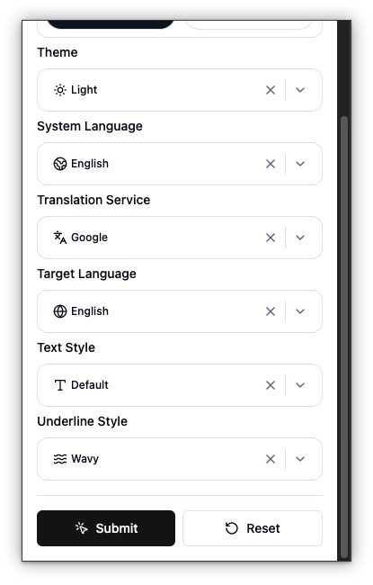
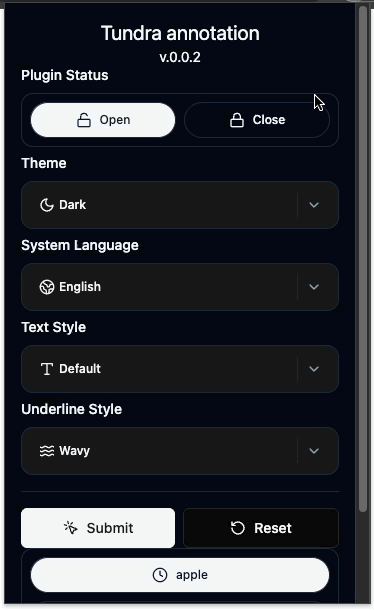

# <p align="center">Tundra Annotation - Browser Extension</p>

<p align="center">
  <em>An open source web note taking / highlighter browser plugin.</em>
</p>
<p align="center">
    
    
    
    
    
</p>

## 🚀 Features

- Accurate serialization and deserialization can adapt to most web pages
- This plugin supports highlighting the formula part
- Powerful and reliable web highlighting
- This plugin supports multiple highlight styles and can be customized
- Modern technology stack
- This plugin supports dark mode and localization
- Reserve note comment function
- Backend services coming soon

## ❇️ Tech Stack

- ✅ **Wxt**: [Wxt](https://wxt.dev)
- ✅ **React**: [React](https://react.dev/)
- ✅ **Tailwind css**: [Tailwind css](https://tailwindcss.com)
- ✅ **Shadcn UI**: [Shadcn UI](https://ui.shadcn.com)
- ✅ **Zustand**: [Zustand](https://zustand-demo.pmnd.rs)
<p align="center">
  
  
  
</p>

## 📦 Running chrome extension

First, you need to install WXT globally

```
pnpm i -D wxt
```

Second, you need to install project
dependencies, then run the project

```
pnpm install
pnpm run dev
```

When you have completed these steps, `WXT` will help you open new tabs

## 📦 Building chrome extension

```
pnpm run build
```

## 🏗️ Project Refactoring

### Select Component properties

| Property           | Description                                                                                                    | Type                                          | DefaultValue |
| :----------------- | :------------------------------------------------------------------------------------------------------------- | :-------------------------------------------- | :----------- |
| variant            | Variants of selector                                                                                           | `string`                                      | `default`    |
| selectType         | Component type, you can choose single selection or multiple selection, the default value is multiple selection | `string`                                      | `multiple`   |
| options            | Select options.                                                                                                | `SelectOptionConfig[]`, `SelectGroupConfig[]` | `[]`         |
| defaultValue       | Initial selected option                                                                                        | `string`, `string[]`                          | `[]`         |
| placeholder        | Placeholder of select                                                                                          | `string`                                      | `-`          |
| animation          | The duration of the animation                                                                                  | `number`                                      | `0`          |
| animationConfig    | The animation type of the badge                                                                                | `AnimationConfig `                            | `-`          |
| className          | TailwindCSS class name                                                                                         | `string`                                      | `''`         |
| hideSelectAll      | Hide select all                                                                                                | `boolean`                                     | `false`      |
| searchable         | show search input                                                                                              | `boolean`                                     | `true`       |
| emptyIndicator     | empty search display                                                                                           | `React.ReactNode`                             | `-`          |
| autoSize           | Automatic width                                                                                                | `boolean`                                     | `false`      |
| singleLine         | A row of display badge                                                                                         | `boolean`                                     | `false`      |
| popoverClassName   | Popover Content class name                                                                                     | `string`                                      | `''`         |
| disabled           | Whether disabled select                                                                                        | `boolean`                                     | `false`      |
| responsive         | Whether to provide responsive settings                                                                         | `boolean`, `DeviceConfig`                     | `false`      |
| minWidth           | Minimum width                                                                                                  | `string`                                      | `''`         |
| maxWidth           | Maximum width                                                                                                  | `string`                                      | `''`         |
| deduplicateOptions | Remove duplicate options                                                                                       | `boolean`                                     | `false`      |
| closeOnSelect      | Automatically close the popup after selecting an option                                                        | `boolean`                                     | `false`      |

### SelectOptionConfig

#### Configuration Select Options

| Name     | Type                                          |
| :------- | :-------------------------------------------- |
| style    | `BadgeStyleConfig`                            |
| label    | `string`                                      |
| value    | `string`                                      |
| disabled | `disabled`                                    |
| icon     | `React.ComponentType<{ className?: string }>` |

### SelectGroupConfig

#### Configuration Group Select Options

| Name    | Type                   |
| :------ | :--------------------- |
| heading | `string`               |
| options | `SelectOptionConfig[]` |

### AnimationConfig

#### Badge animation type

| Name           | Description                   | Type     | Optional values                                                | DefaultValue |
| :------------- | :---------------------------- | :------- | :------------------------------------------------------------- | :----------- |
| badgeAnimation | Motion animation of the badge | `string` | `bounce`, `pulse`, `wiggle`, `fade`, `slide`, `shake` , `none` | `none`       |
| duration       | Animation duration            | `number` | `-`                                                            | `0`          |
| delay          | Animation delay               | `number` | `-`                                                            | `0`          |

### DeviceConfig

#### Device-responsive configuration

`Partial<Record<Devices, ResponsiveConfig>>`

### Devices

`type Devices = "mobile" | "tablet" | "desktop"`

### ResponsiveConfig

`interface ResponsiveConfig {
  hideIcon?: boolean;
  compactMode?: boolean;
}`

## Using this component alone

```
const [defaultValue, setDefaultValue] = useState<string[]>(["react"]);
const options: SelectOptionConfig[] = [
 {
  value: "react",
  label: "React",
 },
 {
  value: "vue",
  label: "Vue.js",
  icon: Icons.clock,
  style: {
   badgeColor: "#0E86F3",
   iconColor: "#FCB516",
  },
 },
 {
  value: "svelte",
  label: "Svelte",
  style: {
   badgeColor: "#09C2FC",
  },
 },
 { value: "angular", label: "Angular" },
];
<Select
 selectType="multiple"
 options={options}
 animationConfig={{
  badgeAnimation: "slide",
 }}
 defaultValue={defaultValue}
 onValueChange={(value: string[]) => {
  console.log(value);
 }}
/>
```

## Use in conjunction with Form component

```
type FormValues = {
 status: string;
}

const defaultValues = {
 status: "open",
};

const form = useForm<FormValues>({
 defaultValues: defaultValues,
});

const onSubmit = (data: FormValues) => {
 // submit
 console.log("data", data);
};

<form onSubmit={form.handleSubmit(onSubmit)}>
  <FormField
    control={form.control}
    name="status"
    render={({ field }) => (
      <FormItem className="mb-2">
        <FormLabel>{t("i18n_Plugin_Status")}</FormLabel>
        <FormControl>
          <Select
            options={[
              {
                label: "i18n_OPEN",
                value: "open",
              },
              {
                label: "i18n_CLOSE",
                value: "close",
              },
            ]}
            defaultValue={field.value}
            onValueChange={field.onChange}
            animationConfig={{
              badgeAnimation: "bounce",
            }}
            selectType="single"
          />
        </FormControl>
        <FormMessage />
      </FormItem>
    )}
  />
</form>;
```

## How to use the switch component in a form

```
<form onSubmit={form.handleSubmit(onSubmit)}>
<FormField
  control={form.control}
  name="status"
  render={({ field }) => (
    <FormItem className="mb-2">
      <FormLabel>{t("i18n_Plugin_Status")}</FormLabel>
      <FormControl>
        <Switch
          options={options.STATUS}
          defaultValue={field.value}
          onValueChange={(value: string) => {
          }}
          animationConfig={{
            badgeAnimation: "bounce",
          }}
          switchType={SwitchType.Horizontal}
        />
      </FormControl>
      <FormMessage />
    </FormItem>
  )}
/>
</form>
```

## Using switch component alone

```
const fruitOptions: RadioOptionConfig[] = [
  {
    label: "apple",
    value: "a",
    icon: Icons.clock,
  },
  {
    label: "banana",
    value: "b",
    icon: Icons.dog,
  },
  {
    label: "cocount",
    value: "c",
    icon: Icons.cat,
  },
];
<Switch
  options={fruitOptions}
  variant={"default"}
  animationConfig={{
    badgeAnimation: "wiggle",
  }}
  switchType={SwitchType.Vertical}
  defaultValue={fruitOptions[0].value}
  onValueChange={() => {}}
/>
```

</form>
