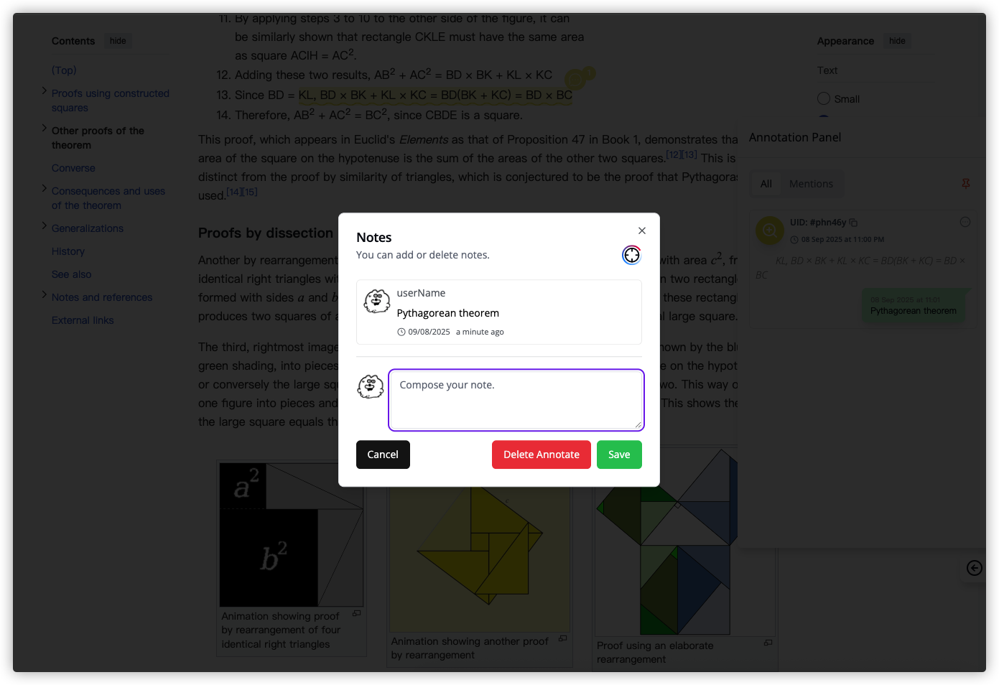
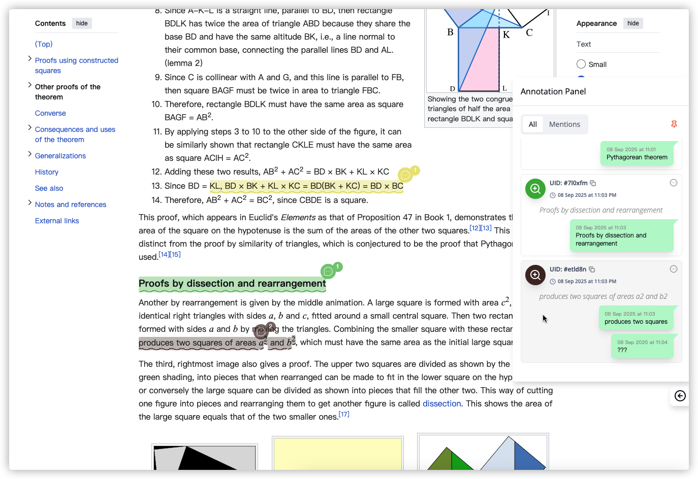
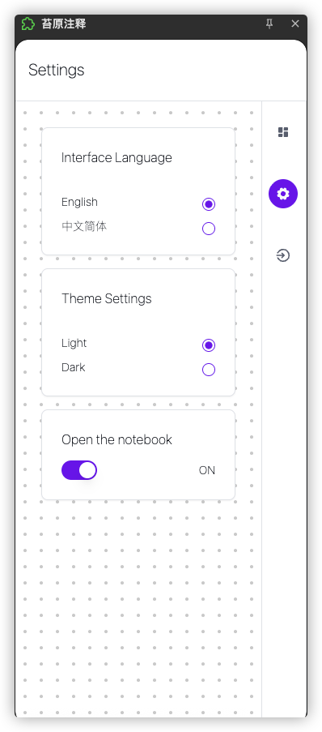

# <p align="center">Tundra Annotation - Browser Extension</p>

<p align="center">
  <em>An open source web note taking / highlighter browser plugin.</em>
</p>
<p align="center">
    
    
    
    
    
</p>

## 🚀 Features

- Accurate serialization and deserialization can adapt to most web pages
- This plugin supports highlighting the formula part
- Powerful and reliable web highlighting
- This plugin supports multiple highlight styles and can be customized
- Modern technology stack
- This plugin supports dark mode and localization
- Reserve note comment function
- **Local data storage with IndexedDB** - All annotations are stored locally for fast access
- **Real-time color modification** - Change annotation colors on the fly
- **Comprehensive annotation management** - Create, edit, and delete annotations with ease

## ❇️ Tech Stack

- ✅ **Wxt**: [Wxt](https://wxt.dev)
- ✅ **React**: [React](https://react.dev/)
- ✅ **Tailwind css**: [Tailwind css](https://tailwindcss.com)
- ✅ **Shadcn UI**: [Shadcn UI](https://ui.shadcn.com)
- ✅ **Zustand**: [Zustand](https://zustand-demo.pmnd.rs)
- ✅ **IndexedDB**: Local storage for annotations and notes
<p align="center">
  
  
  
</p>

## 📦 Running chrome extension

First, you need to install WXT globally

```
pnpm i -D wxt
```

Second, you need to install project
dependencies, then run the project

```
pnpm install
pnpm run dev
```

When you have completed these steps, `WXT` will help you open new tabs

## 💾 Local Data Storage

The extension now features comprehensive local data storage using IndexedDB:

- **Annotations Database**: Stores all highlight annotations with metadata
- **Notes Database**: Manages user notes and comments
- **Page Data Database**: Tracks page information and metadata
- **Offline Support**: All data is stored locally for offline access
- **Real-time Sync**: Changes are immediately persisted to IndexedDB

### Database Structure

```typescript
// Annotation Schema
interface Annotate {
  uid: string;
  color: string;
  data: {
    notes: Note[];
  };
  pageData: {
    url: string;
    title: string;
    host: string;
  };
  createDate: number;
  updateDate: number;
}
```

<p align="center">
  
</p>

## 💼 Packages

```
.
├── assets
│   ├── font.css
│   └── main.css
├── components
│   ├── chatBubble
│   ├── collapsePanel
│   ├── i18Config.ts
│   ├── i18n.ts
│   ├── icons
│   ├── settings
│   ├── skeletonLoader
│   └── ui
├── components.json
├── entrypoints
│   ├── background.ts
│   ├── content
│   │   ├── globalStyles.css
│   │   ├── index.tsx
│   │   ├── style.css
│   │   ├── AnnotateDom
│   │   ├── AnnotationManager
│   │   ├── App
│   │   ├── Header
│   │   ├── Hooks
│   │   └── state
│   ├── handlers
│   │   ├── AnnotationHandler.ts
│   │   ├── ExtensionHandler.ts
│   │   ├── MessageRouter.ts
│   │   ├── SystemHandler.ts
│   │   └── types.ts
│   ├── popup
│   ├── sidebar.tsx
│   ├── sidepanel
│   └── type.ts
├── hooks
│   ├── useMobile.tsx
│   ├── useStorage.tsx
│   └── useStorage.type.ts
├── lib
│   ├── Marks
│   ├── SelectionObserver.ts
│   ├── Utils.ts
│   └── ZodValidator.ts
├── locales
│   ├── en
│   └── zh_CN
├── package.json
├── pnpm-lock.yaml
├── postcss.config.js
├── public
│   ├── _locales
│   ├── icon
│   └── wxt.svg
├── README.md
├── services
│   ├── annotation.db.ts
│   ├── api.ts
│   ├── api.type.ts
│   ├── indexeddb.config.ts
│   ├── indexeddb.example.ts
│   ├── indexeddb.index.ts
│   ├── indexeddb.init.ts
│   ├── indexeddb.services.ts
│   ├── indexeddb.type.ts
│   ├── note.db.ts
│   ├── pagedata.db.ts
│   └── services.ts
├── state
│   ├── constant.ts
│   ├── hooks.ts
│   ├── index.tsx
│   ├── store.ts
│   └── type.ts
├── tailwind.config.js
├── tsconfig.json
└── wxt.config.ts
```

## 📦 Building chrome extension

```
pnpm run build
```

## 👀 Considerations

The project now uses IndexedDB for local data storage. Key service files include:

```
├── services
│   ├── annotation.db.ts      # Annotation database operations
│   ├── api.ts               # API interfaces
│   ├── api.type.ts          # API type definitions
│   ├── indexeddb.config.ts  # IndexedDB configuration
│   ├── indexeddb.index.ts   # Database indices
│   ├── indexeddb.init.ts    # Database initialization
│   ├── indexeddb.services.ts # Database service layer
│   ├── indexeddb.type.ts    # Database type definitions
│   ├── note.db.ts           # Notes database operations
│   ├── pagedata.db.ts       # Page data database operations
│   └── services.ts          # Legacy mock data (can be modified)
```

**Data Storage:**

- All annotations are stored locally using IndexedDB
- Supports offline functionality
- Fast retrieval and modification of annotations
- Automatic data persistence

## 🏗️ Project refactoring

[refactoring branch](https://github.com/sarbia-offical/tundra_annotation/tree/refactor/v2)
